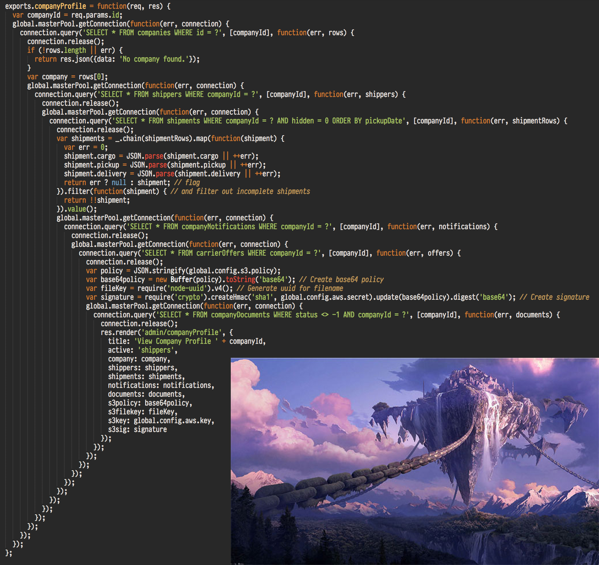

Functional Programming with Generators
=======================================

decks to go with my talk on programming with generators

##Slide 1

###Introduction to generators

1. New ecmascript 6 feature
2. New addition to the javascript language for handling concurrency
3. great for writing syncronous(looking) co-routines that are synchronous

##Slide 2
###Preliminaries

to Really understand what generators are good for, you need to understand the problems they are created to solve.

###The evolution of node concurrency

####In the beggining there was node style

```
var fs = require('fs');
fs.readFile('./somefile.dat', 'utf8', function(err, contents) {
  if (err) { throw err; }
  else {
  	console.log(contents);
  }
  
})

```

##Slide 3

###Advantages

* Simple
* Fast

##Slide 4

###Disadvantages
#### Orchestrating multiple concurrent tasks becomes very hard
	
if for c = C(A(), B()), A and or B are asynchronous functions, how do you 
make sure c is not run until both A and B resolve?

```
A(function(err, a) {
  B(function(err, b) {
  	C(a, b, function(c) {
  	  //c is available here
  	  console.log(c);
  	});
  });
});

```
This can very quickly spiral out of control...




##Slide 5

###Enter Promises

* much more fine grained
* functions immediatly return a "promise" that can be used to get the result of an asynchronous computation
* thes promises can be chained together to make asynchronous control flows read synchronously

```
var Promise = require('bluebird');
//assuming A, B and C are now promise yielding functions
Promise.all([A(), B()])
.spread(function(a, b) {
  return C(a, b);
})
.then(function(c) {
  console.log(c);
})
.catch(function(err) {
  console.log(err.message, err.stack);
});

```

##Slide 6
* much better!!
* code scales to handle any number of asynchronous dependencies

###Limitations

* cannot access the result of an asynchronous computation within a stack frame. You can only extend the promise chain and get a new promise.
* All async functions need to be written to return functions or be wrapped in in a promisfying functions 

example: 
```
	var readFile = Promise.promisify(fs.readFile);
```

##Slide 7
###Generators

####Anatomy of a generator

```
var Gen = function *() { //notice the asterix
  var val = yield 6; //yield keyword stops the function
  return val  + 3;
};
	
var gen = Gen(); //instantiate the generator
var val = gen.next().value //val === 6
console.log(gen.next(val).value) //prints 9

```

* Basicly a function with an internal state for tracking where it is in its execution
* stops when it hits a yield keyword
* can resume by calling its ```gen.next()``` method

```next()``` return an object

```
{
  value: [whatever was on the right side of the yield keyword],
  done: [true if you can continue calling next() to increment the generator]
}
	
```

##Slide 8
####Coroutines

A coroutine is a stack of executing code that runs independently of the main thread. The closest analoge out there are ruby fibers and python coroutines.

lets write a basic co routine, it only handles promises

```
/*
  next takes a instatiated generator and calls
  and a value returned from calling next on it
  gen is an instance of a generator
  yieldable is the value returned from calling gen.next()
*/
var next = function(gen, yieldable, cb) {
  if (!yieldable.done) { //if 
    /*
    	we assume yieldable.value is a promise 
    	so we call then() to get the value
    */
    yieldable.value.then(function(val) {
      return next(gen, gen.next(val), cb);
    }).catch(function(e) {});
    /*
    	we intentionally break the promise chain 
    	if there is an error
    */
    yieldable.value.catch(function(err) {
      cb(err);
    })
  } else {
    cb(null, yieldable.value);
  }
};

//takes a generator and a callback function
var co = function(fngen) {
  
  return function(cb) {
    //instatiate the generator
    var gensym = fngen();
    //get the first yieldable
    var yieldable = gensym.next();
    if (!yieldable.done) {
      next(gensym, yieldable, cb);
    } else {
      cb(null, yieldable.value);
    }
  };
};


```

##Slide 9
### [visionmedia/co](https://github.com/visionmedia/co)

```
npm install co --save

```

co takes a generator and returns a function that runs the generator. Anything yielded will resolve and be immediatly asssigned to the value on the right side.

Works with
* promises
* thunks
* generators
* array (parallel execution)
* objects (parallel execution)
* generators (delegation)
* generator functions (delegation)

Only works with One generator at a time however.

##Slide 10
###functional programming with generators

* generators are first class just like functions
* Can we create a function that merges two generators together?
* koa style flow control?

###can we compose generators to make larger generators?

how do we compose two functions?

```
var compose = function(A, B) {
  return function() {
    return B.call(this, A.apply(this, arguments));
  };
};

```

##Slide 11
what would something similar for generators look like?
Join(gen1, gen2) => gen3;

```
var join = function(Gen1, Gen2) {
  return function *() {
    return yield Gen1.call(this, Gen2.call(this));
  };
};

```

we can drop this into a ```co()``` and use it to create a generator that flows between the two generators

```
co(join(function*(next) {
  return yield next;
  }, function *() {
    return yield fs.readFileAsync(path.join(__dirname, 'foo.dat'), 'utf8');
  }))(function(err, val) {
    console.log(val); // "hello world!"
  });
  
```

##Slide 12
###how it works

* co itself instantiates the generator,  it iterates through till there is nothing left to yield.
* If a generator is yielded,  it will instantiate that generator and run it till there is nothing left to yield and return the return value to the original generator. if that generator yields to a generator, the same rules apply. Its sort of like recursion.

###what about composing 3 or more generators?

#### it gets.. complicated. 

##Slide 13

###Introducing Shen, a toolbox for composing generators

[cultofmetatron/Shen](https://github.com/cultofmetatron/Shen)


 